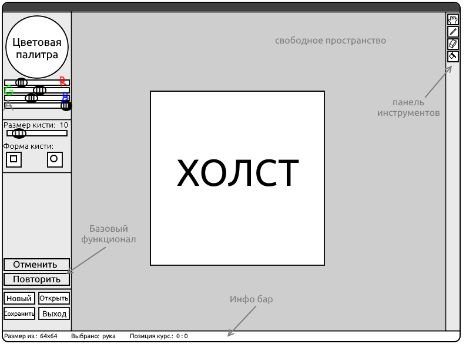
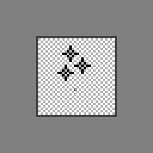
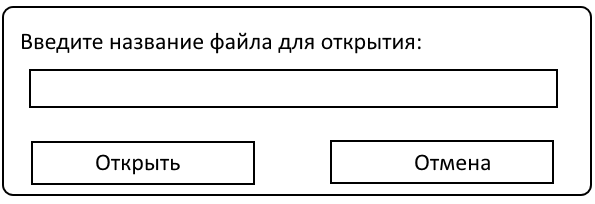

# IconEditor
Курсовая работа по программированию 1 курс

## Постановка задачи
Задача состоит в разработке растрового редактора иконок Windows (формат .ico) на языке программирования C++. 
Созданные иконки будут использоваться для отображения на веб-сайтах – так называемые favicon.

Для разработки будет использоваться среда разработки Visual Studio 2015, компилятор Visual C++14, 
реализующий стандарт C++11. Также в разработке будет участвовать мультимедийная библиотека SDL2 
для работы с оконной, графической подсистемой и подсистемой ввода (клавиатура/мышь). Данная 
библиотека является наиболее популярной для разработки мультимедийных систем (в основном игр). 

Основными целями в разработке программы является улучшение навыков программирования на языке C++ и 
получение опыта в разработке программ, графических редакторов в частности. В процессе работы будет 
изучены способы работы с двумерной графикой и будет изучен формат .ico и работа с ним. 

Формат файла .ico представляет из себя коллекцию изображений, поддерживающих разнообразную палитру 
цветов и альфа-канал (прозрачность). Эта коллекция используется при масштабировании иконок Windows – 
чем больше ярлык, тем более высокого разрешения используется иконка из своей коллекции. Эта коллекция 
также может содержать всего одно изображение. Чаще всего такой подход одного изображения используется 
при создании иконок для веб-страниц – favicon. Именно на него я и буду опираться при разработке редактора.

Графический редактор простейших иконок для сайтов не должен содержать обилие различных инструментов и 
настроек – вполне достаточно иметь лишь руку, кисть, ластик и заливку. Кисть и ластик будут иметь только 
пару самых нужных настроек: размер кисти и форма кисти (круг или квадрат). Заливка будет менять ближайшие 
пиксели одного цвета на нужный цвет. Рука нужна для перемещения рабочей области относительно свободного 
пространства.

Из функционала обязательно должна быть цветовая палитра, позволяющая визуально выбрать нужный цвет. Если 
необходимы чёткие цвета по известным значениям цветовой модели RGB, то будет возможность ввести их в 
специальную графу под палитрой. Также пригодится возможность приближения/отдаления изображения для более 
точного редактирования. 

Программа должна поддерживать (но не в полной мере) формат .ico; программа должна иметь возможность 
сохранять и загружать его. 

Так как пишется простейший редактор иконок, то на используемый формат введено одно ограничение: файл иконки 
не должен содержать более одного изображения, а также высота изображения должна совпадать с его шириной. 
Других ограничений нет. Однако стоит учитывать, что сам формат .ico имеет некоторые ограничения. Например, 
его размер не может превышать 256x256 точек.

Для удобства использования на нижней части окна будет отображаться некоторая информация: размер текущего 
изображения, выбранный инструмент и текущая позиция курсора на холсте. 

Используя все вышесказанные возможности, главное окно программы должно будет выглядеть примерно следующим 
образом: 

Функции отменить/повторить работают в точности так же, как и в любых других редакторах: они отменяют или 
повторяют последнее действие соответственно. 

Для увеличения/уменьшения изображения следует использовать соответствующие горячие клавиши: 
Ctrl+Колёсико мыши вверх (Ctrl+=) и Ctrl+Колёсико мыши вниз (Ctrl+-)

При выборе пункта «Новый» появляется меню, содержащее лишь вопрос пользователя о необходимом размере иконки 
следующего вида:

При выборе «Открыть» у пользователя спрашивается название файла с иконкой, которая должна находиться в той же 
директории, что и программа. 

При выборе «Сохранить» у пользователя спрашивается название файла, в которое будет записано всё изображение. 
Иконка будет сохранена в той же директории, что и программа.

При выборе «Выход» процесс выполнения программы завершается.

## Описание используемого формата .ico
### Общее
* Размеры изображения: 16х16, 32х32, 48х48, 64х64;
* Количество изображений в файле: 1;
* Глубина цвета: 32-бит;
* Количество цветов: 32-бит;
* Количество плоскостей: 1.

### Спецификация формата
#### ICONDIR
Offset | Размер (в байтах) | Назначение
--- | --- | ---
0 | 2 | Зарезервировано. Всегда 0.
2 | 2 | Тип файла. (0 - курсор Windows, 1 - иконка)
4 | 2 | Количество изображений в файле. Для нас оно должно быть одно.
**ВСЕГО:** 6

#### ICONDIRENTRY
Offset | Размер (в байтах) | Назначение
--- | --- | ---
0 | 1 | Ширина изображения в пикселях.
1 | 1 | Высота изображения в пикселях.
2 | 1 | Количество цветов в палитре.
3 | 1 | Зарезервировано. Всегда 0.
4 | 2 | Количество плоскостей.
6 | 2 | Количество битов на пиксель.
8 | 4 | Размер растра в байтах.
12 | 4 | Абсолютное смещения растра в файле.
**ВСЕГО:** 12

Во всех .bmp изображениях имеется структура BITMAPFILEHEADER. Но в формате .ico она опускается, остаётся лишь BITMAPINFOHEADER.

#### BITMAPINFOHEADER
Offset | Размер (в байтах) | Назначение
--- | --- | ---
0 | 4 | Размер данной структуры в байтах.
4 | 4 | Ширина растра в пикселях.
8 | 4 | Содержит два параметра: высота растра в пикселях и порядок следования строк в двумерных массивах.
12 | 2 | Количество плоскостей, всегда равно 1.
14 | 2 | Количество битов на пиксель.
16 | 4 | Указывает способ хранения пикселей. В формате .ico данное поле равно 0.
20 | 4 | Размер пиксельных данных в байтах.
24 | 4 | Количество пикселей на метр по горизонтали. В формате .ico данное поле равно 0.
28 | 4 | Количество пикселей на метр по вертикали. В формате .ico данное поле равно 0.
32 | 4 | Размер таблицы цветов в ячейках. В формате .ico данное поле равно 0.
36 | 4 | Количество ячеек от начала таблицы цветов до последней используемой. В формате .ico данное поле равно 0.
**ВСЕГО:** 40

Далее идут пиксельные данные в количестве ШИРИНА * ВЫСОТА в формате **BB GG RR SS**, где B - Blue, G - Green, R - Red, S - Reserved (всегда FF).
